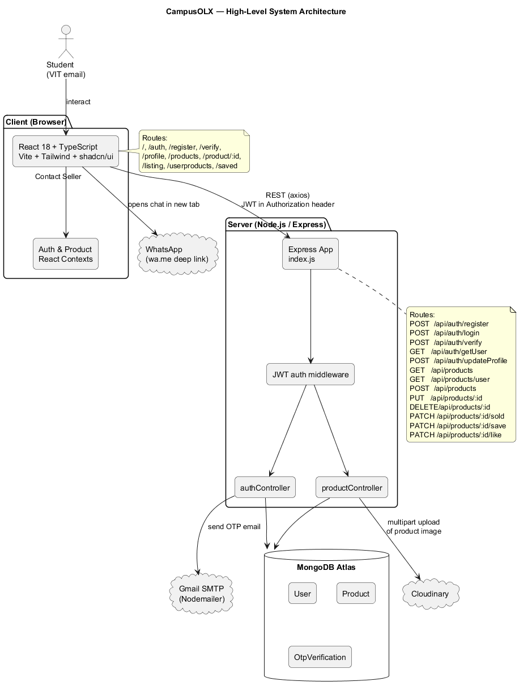
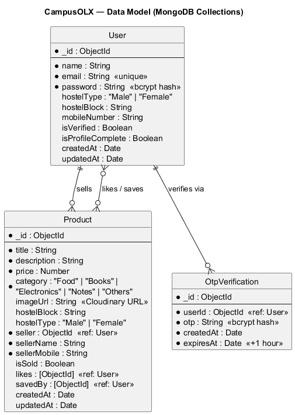
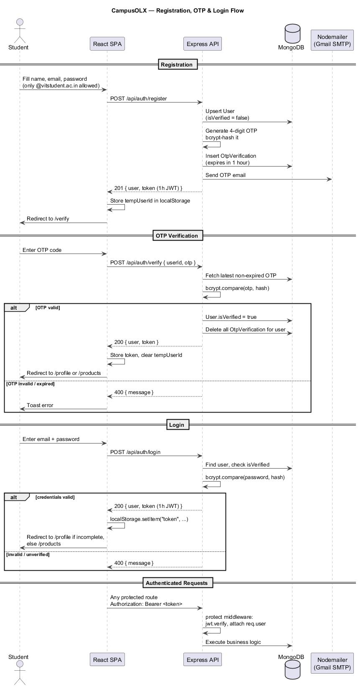
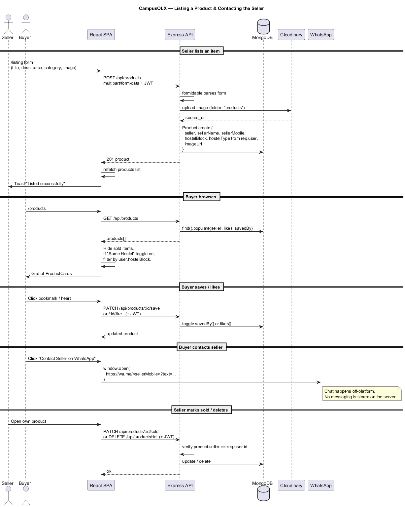
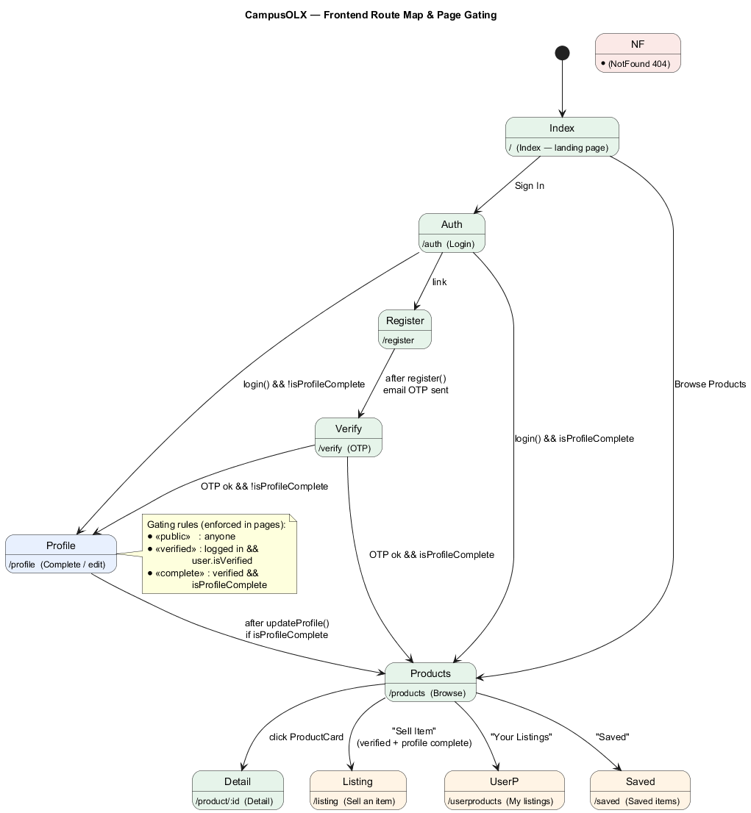

# University LX

> A hostel-aware campus marketplace where verified university students can list, discover, save and buy second-hand items from peers inside the same campus, with WhatsApp as the off-platform contact channel.

Built as a MERN-stack project (MongoDB + Express + React + Node) with image hosting on Cloudinary, email-OTP verification via Gmail SMTP and a Vite/Tailwind/shadcn-ui front-end.

---

## Table of contents

- [Highlights](#highlights)
- [Tech stack](#tech-stack)
- [System architecture](#system-architecture)
- [Data model](#data-model)
- [Authentication &amp; verification flow](#authentication--verification-flow)
- [Listing &amp; contact flow](#listing--contact-flow)
- [Frontend route map](#frontend-route-map)
- [Project structure](#project-structure)
- [REST API reference](#rest-api-reference)
- [Getting started](#getting-started)
- [Environment variables](#environment-variables)
- [Deployment notes](#deployment-notes)
- [Re-rendering the diagrams](#re-rendering-the-diagrams)
- [Roadmap / known limitations](#roadmap--known-limitations)
- [License](#license)

---

## Highlights

- **University-only sign-up** — registration is locked to `*@vitstudent.ac.in` addresses (see [Frontend/src/utils/checkEmail.ts](Frontend/src/utils/checkEmail.ts)). Adapt the regex to onboard a different campus.
- **Email-OTP account verification** — a 4-digit code is bcrypt-hashed and stored with a 1-hour TTL ([Backend/controllers/authController.js](Backend/controllers/authController.js)).
- **Profile gating** — users must complete `name + hostelType + hostelBlock + mobileNumber` before they can list items, contact sellers, save or like.
- **Same-hostel mode** — a single toggle on the browse page filters listings down to the buyer's own hostel block.
- **Image uploads to Cloudinary** — products are uploaded as `multipart/form-data` parsed by `formidable`, then forwarded to Cloudinary under the `products/` folder ([Backend/controllers/productController.js](Backend/controllers/productController.js#L39-L88)).
- **Off-platform messaging** — clicking *Contact Seller* opens a pre-filled WhatsApp chat (`wa.me`), so the app never has to store or moderate chats.
- **Save / like / mark-as-sold** — lightweight engagement primitives backed by `savedBy[]`, `likes[]` and an `isSold` flag on each product.
- **Polished UI** — Tailwind CSS + the shadcn/ui component set (Radix UI primitives), `react-router-dom v6`, `sonner` toasts and TanStack Query are already wired in.

---

## Tech stack

| Layer | Choices |
|-------|---------|
| **Frontend** | React 18, TypeScript, Vite, Tailwind CSS, shadcn/ui (Radix UI), `react-router-dom` v6, `@tanstack/react-query`, `axios`, `sonner`, `lucide-react`, `react-hook-form`, `zod` |
| **Backend** | Node.js, Express 4, Mongoose 8, `jsonwebtoken`, `bcryptjs`, `formidable`, `cors`, `dotenv` |
| **Database** | MongoDB (Atlas-friendly) |
| **Storage** | Cloudinary (product images) |
| **Email** | Nodemailer + Gmail SMTP (OTP delivery) |
| **Messaging** | WhatsApp deep links (`https://wa.me/…`) |
| **Hosting** | Vercel (separate projects for Backend and Frontend — see `vercel.json` in each folder) |

---

## System architecture



In plain English:

- A single Express server exposes `/api/auth/*` and `/api/products/*`, talks to **MongoDB Atlas**, uploads images to **Cloudinary**, and sends OTP emails via **Gmail SMTP**.
- The React SPA stores the JWT in `localStorage` and sends it as `Authorization: Bearer <token>` on every protected call. Two contexts (`AuthProvider`, `ProductProvider`) own all client-side state and expose hooks (`useAuth`, `useProducts`).
- The buyer ↔ seller conversation never touches the server — it's a `window.open("https://wa.me/...")` redirect from the product page.

Source: [`docs/diagrams/architecture.puml`](docs/diagrams/architecture.puml)

---

## Data model



Three collections:

- **User** — `email` is unique. `password` is `bcrypt`-hashed via a Mongoose `pre("save")` hook ([Backend/models/User.js](Backend/models/User.js)). `isVerified` flips to `true` only after a valid OTP is presented; `isProfileComplete` only when all four profile fields are filled.
- **Product** — denormalises `sellerName` and `sellerMobile` onto the document at create-time so the browse list doesn't need an extra populate-and-join for every card. `likes[]` and `savedBy[]` are arrays of user `ObjectId`s.
- **OtpVerification** — short-lived (1 h) records whose `otp` field stores a **hashed** 4-digit code. All records for a user are wiped after a successful verification.

Source: [`docs/diagrams/erd.puml`](docs/diagrams/erd.puml)

---

## Authentication &amp; verification flow



Implementation entry-points:

- `registerUser` / `verifyOtp` / `loginUser` / `getUserInfo` / `updateProfile` — [Backend/controllers/authController.js](Backend/controllers/authController.js)
- JWT-gated routes — [Backend/middleware/authMiddleware.js](Backend/middleware/authMiddleware.js) (`protect` decodes the bearer token and attaches `req.user`)
- Client-side state machine — [Frontend/src/utils/authContext.tsx](Frontend/src/utils/authContext.tsx)

Tokens are signed with `JWT_SECRET` and currently expire after **1 hour**. The frontend re-hydrates the session on load by calling `GET /api/auth/getUser` with the stored token.

Source: [`docs/diagrams/auth-flow.puml`](docs/diagrams/auth-flow.puml)

---

## Listing &amp; contact flow



Key implementation details:

- Image upload is parsed with `formidable` and forwarded to Cloudinary under `folder: "products"`. The returned `secure_url` is the only thing persisted in MongoDB.
- The product's `hostelBlock` / `hostelType` are **auto-filled from the seller's profile** — sellers cannot list against a hostel that isn't theirs.
- *Same Hostel Mode* on `/products` filters the in-memory list to `product.hostelBlock === user.hostelBlock`, never re-hitting the API ([Frontend/src/utils/productContext.tsx](Frontend/src/utils/productContext.tsx)).
- Owner-only actions (mark sold, delete, update) are double-checked server-side via `product.seller.toString() !== req.user.id`.

Source: [`docs/diagrams/listing-flow.puml`](docs/diagrams/listing-flow.puml)

---

## Frontend route map



Gating rules enforced in the page components themselves:

| Bucket | Pages | Required state |
|--------|-------|----------------|
| Public | `/`, `/auth`, `/register`, `/verify`, `/products`, `/product/:id` | none |
| Verified | `/profile` | logged in &amp;&amp; `user.isVerified` |
| Profile-complete | `/listing`, `/userproducts`, `/saved` | verified &amp;&amp; `isProfileComplete` |

Source: [`docs/diagrams/frontend-routes.puml`](docs/diagrams/frontend-routes.puml)

---

## Project structure

```
CampusOLX Final/
├── Backend/
│   ├── config/db.js                   # Mongoose connection
│   ├── controllers/
│   │   ├── authController.js          # register / login / verify-otp / profile
│   │   └── productController.js       # CRUD + like/save/mark-sold
│   ├── middleware/authMiddleware.js   # JWT "protect"
│   ├── models/
│   │   ├── User.js
│   │   ├── Product.js
│   │   └── OtpVerification.js
│   ├── routes/
│   │   ├── authRoutes.js
│   │   └── productRoutes.js
│   ├── index.js                       # express app entry
│   ├── vercel.json
│   └── package.json
│
├── Frontend/
│   ├── src/
│   │   ├── pages/                     # Index, Auth, Register, Verify,
│   │   │                              # Profile, Products, ProductDetail,
│   │   │                              # ProductListing, UserProducts,
│   │   │                              # SavedProducts, NotFound
│   │   ├── components/
│   │   │   ├── layout/                # Header, Footer
│   │   │   └── ui/                    # shadcn/ui primitives + ProductCard
│   │   ├── utils/
│   │   │   ├── authContext.tsx
│   │   │   ├── productContext.tsx
│   │   │   ├── checkEmail.ts          # vitstudent.ac.in regex
│   │   │   └── types.ts               # User, Product, HOSTEL_BLOCKS, CATEGORIES
│   │   ├── App.tsx                    # router + providers
│   │   └── main.tsx
│   ├── vite.config.ts
│   ├── tailwind.config.ts
│   ├── vercel.json
│   └── package.json
│
├── docs/
│   ├── diagrams/                      # PlantUML sources + rendered PNGs
│   │   ├── architecture.puml / .png
│   │   ├── erd.puml / .png
│   │   ├── auth-flow.puml / .png
│   │   ├── listing-flow.puml / .png
│   │   └── frontend-routes.puml / .png
│   └── plantuml.jar                   # local PlantUML renderer
│
└── README.md
```

---

## REST API reference

Base URL: `${VITE_BACKEND}` (e.g. `http://localhost:5000`)

All `protect`-marked endpoints require an `Authorization: Bearer <jwt>` header.

### Auth — `routes/authRoutes.js`

| Method | Path | Auth | Body | Purpose |
|--------|------|------|------|---------|
| `POST` | `/api/auth/register` | — | `{ name, email, password }` | Creates / re-uses the user, emails a 4-digit OTP, returns a 1-h JWT |
| `POST` | `/api/auth/verify` | — | `{ userId, otp }` | Verifies OTP, flips `isVerified=true`, returns a fresh JWT |
| `POST` | `/api/auth/login` | — | `{ email, password }` | Returns JWT if credentials match **and** user is verified |
| `GET`  | `/api/auth/getUser` | ✅ | — | Returns the current user (minus `password`) |
| `POST` | `/api/auth/updateProfile` | ✅ | `{ name?, hostelType?, hostelBlock?, mobileNumber? }` | Patches the profile and recomputes `isProfileComplete` |

### Products — `routes/productRoutes.js`

| Method | Path | Auth | Body / Notes | Purpose |
|--------|------|------|--------------|---------|
| `GET`    | `/api/products` | — | — | List all products, populated with seller / likes / savedBy |
| `GET`    | `/api/products/user` | ✅ | — | Only the caller's listings |
| `POST`   | `/api/products` | ✅ | `multipart/form-data` (title, description, price, category, hostelBlock, hostelType, image) | Uploads image to Cloudinary and creates the product |
| `PUT`    | `/api/products/:id` | ✅ (owner) | partial product | Update fields |
| `DELETE` | `/api/products/:id` | ✅ (owner) | — | Delete |
| `PATCH`  | `/api/products/:id/sold` | ✅ (owner) | — | Sets `isSold = true` |
| `PATCH`  | `/api/products/:id/save` | ✅ | — | Toggles `savedBy` for the caller |
| `PATCH`  | `/api/products/:id/like` | ✅ | — | Toggles `likes` for the caller |

---

## Getting started

### Prerequisites

- Node.js 18+ and npm
- A MongoDB connection string (Atlas works out of the box)
- A Cloudinary account (cloud name + API key + secret)
- A Gmail account with an **App Password** for SMTP (Google Account → Security → 2-step verification → App passwords)

### 1. Clone

```bash
git clone <your-fork-url>
cd "CampusOLX Final"
```

### 2. Backend

```bash
cd Backend
npm install
# create Backend/.env using the template below
node index.js
# → "Server running on port 5000"
# → "MongoDB connected"
```

### 3. Frontend

```bash
cd Frontend
npm install
# create Frontend/.env using the template below
npm run dev
# → Vite dev server on http://localhost:8080
```

Open `http://localhost:8080`, register with a `@vitstudent.ac.in` address, check the inbox of `EMAIL_USER` *or* the Gmail account configured to receive a copy, enter the OTP, complete your profile, and you're in.

---

## Environment variables

### `Backend/.env`

```dotenv
MONGO_URI=mongodb+srv://<user>:<pass>@<cluster>/<db>?retryWrites=true&w=majority
JWT_SECRET=<a-long-random-string>

CLOUDINARY_CLOUD_NAME=<your-cloud-name>
CLOUDINARY_API_KEY=<your-api-key>
CLOUDINARY_API_SECRET=<your-api-secret>

EMAIL_USER=<gmail-address-used-as-from>
EMAIL_PASSWORD=<gmail-app-password>

# optional — defaults to "*"
CLIENT_URL=http://localhost:8080
# optional — defaults to 5000
PORT=5000
```

### `Frontend/.env`

```dotenv
VITE_BACKEND=http://localhost:5000
```

> **Don't commit either `.env`.** Both are already covered by [`.gitignore`](.gitignore).

---

## Deployment notes

- Both `Backend/` and `Frontend/` ship with a `vercel.json` and are designed to be deployed as two **separate Vercel projects**.
- After deploying the backend, set `VITE_BACKEND` to the production API URL and rebuild the frontend.
- The backend reads `CLIENT_URL` to lock CORS down to your deployed frontend origin — set it in the Vercel project settings.

---

## Re-rendering the diagrams

The PNGs under [`docs/diagrams/`](docs/diagrams/) were rendered from the `.puml` sources next to them using the bundled `plantuml.jar`. After editing any source, regenerate with:

```bash
# from the repo root (requires Java 8+)
java -jar docs/plantuml.jar -charset UTF-8 -tpng docs/diagrams/*.puml
```

Outputs land next to the `.puml` files. You can also preview interactively with the *PlantUML* extension for VS Code or by pasting into <https://www.plantuml.com/plantuml/>.

---

## Roadmap / known limitations

- **JWT lifetime is 1 hour** with no refresh-token flow — long sessions silently expire and the frontend just unsets the user.
- **No rate limiting / captcha** on `/register`, `/verify` or `/login`.
- **OTPs are sent via Gmail SMTP** — fine for a class project but you'll want a transactional provider (Resend, Postmark, SES) for anything bigger.
- **Hostel filter is client-side** — fine for a few hundred listings but not for scale; move it to a Mongo query when needed.
- **Single image per product**, no gallery or video.
- **The `Index.tsx` hero image is hot-linked** from Unsplash; replace with your own asset for offline use.
- **`Frontend/index.html`** contains a Microsoft Clarity script tag — remove it if you don't want analytics phoning home.

---

## License

No license file is currently included. If you intend to open-source this, add a `LICENSE` (MIT is a sensible default) and reference it here.
